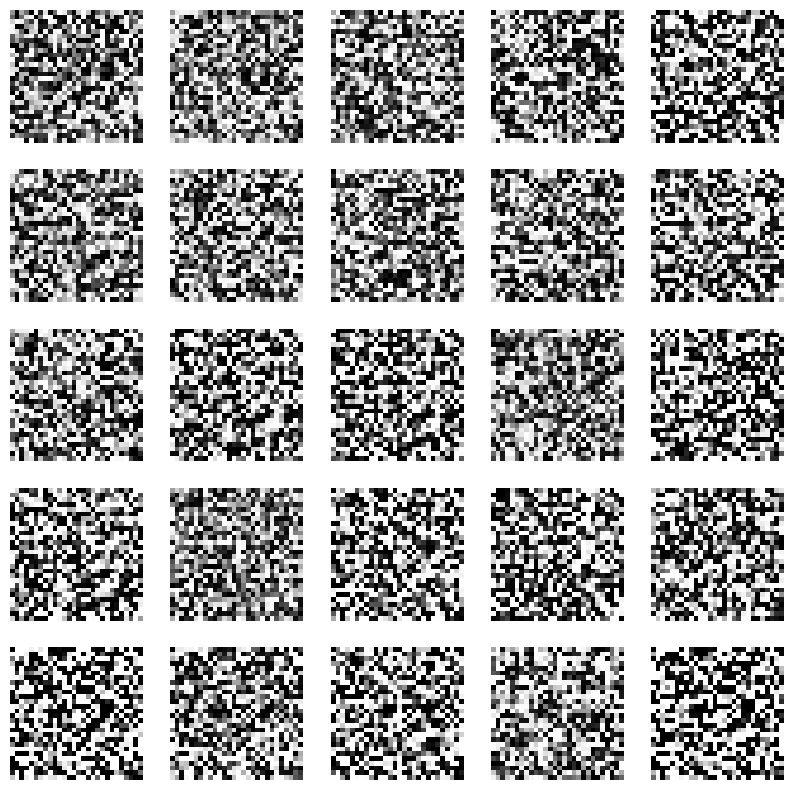

# Keras GAN Model for MNIST Image Generation

data preprocessing

- load MNIST
- reshape data

## Overview

This project implements a basic GAN in Keras for MNIST digit generation.

It preprocesses MNIST images, builds a generator and a discriminator, combines them into a GAN, and trains the models adversarially so the generator can turn random noise into synthetic digit-like images.

## What the Project Does

1. Loads the MNIST training set.
2. Normalizes image values to `[-1, 1]`.
3. Reshapes images to `(28, 28, 1)`.
4. Builds a generator that maps a 100-dimensional random noise vector to a `28 x 28 x 1` image.
5. Builds a discriminator that takes an image and predicts whether it is real or fake.
6. Freezes the discriminator inside the combined GAN model.
7. Trains the discriminator on real MNIST images labeled `1` and generated images labeled `0`.
8. Trains the generator through the GAN so generated images are classified as real.
9. Reports discriminator loss, discriminator accuracy, and generator loss during training.
10. Evaluates the output qualitatively using generated image samples.

## Model Structure

### Generator

using Keras functional API

The Generator:

- a Sequential model
- with Dense, LeakyReLU, BatchNormalization, and Reshape layers to build the generator

Architecture:

- `Dense(256, input_dim=100)`
- `LeakyReLU(alpha=0.2)`
- `BatchNormalization(momentum=0.8)`
- `Dense(512)`
- `LeakyReLU(alpha=0.2)`
- `BatchNormalization(momentum=0.8)`
- `Dense(1024)`
- `LeakyReLU(alpha=0.2)`
- `BatchNormalization(momentum=0.8)`
- `Dense(28 * 28 * 1, activation='tanh')`
- `Reshape((28, 28, 1))`

The generator starts from random latent noise and gradually expands it into a full image.

### Discriminator

- a Sequential model
- Flatten, Dense, and LeakyReLU layers to build the discriminator
- discriminator takes an image as an input and outputs a probability indicating whether the image is real or fake

Architecture:

- `Flatten(input_shape=(28, 28, 1))`
- `Dense(512)`
- `LeakyReLU(alpha=0.2)`
- `Dense(256)`
- `LeakyReLU(alpha=0.2)`
- `Dense(1, activation='sigmoid')`

The discriminator is a binary classifier:

- output near `1` means real
- output near `0` means fake

### Combined GAN

building the whole model

Merging the generator and discriminator to build the GAN model with the Keras functional API.

What I will do:

- Create an input layer for the noise vector
- Pass the noise vector through the generator to produce a synthetic image
- Pass the synthetic image through the discriminator to get the classification
- Compile the GAN using binary cross-entropy loss and the Adam optimizer

In the combined model, the discriminator is frozen while training the generator through the GAN.

## Why the Optimizer and Loss Function Were Chosen

### Optimizer: `adam`

`Adam` is used because it is a standard optimizer for GAN training and usually works better than plain SGD in unstable adversarial settings. It adapts learning rates automatically and is a practical default for small image-generation projects.

### Loss: `binary_crossentropy`

`binary_crossentropy` is used because the discriminator solves a binary classification problem:

- real image = `1`
- fake image = `0`

The generator is trained through the GAN to fool this classifier, so the same adversarial objective naturally fits the setup.

## Technical Characteristics

- adversarial training with two neural networks
- latent noise vector of size `100`
- generator with dense expansion and reshaping
- discriminator for real/fake classification
- `tanh` output in generator
- MNIST normalization to match generator output range
- `LeakyReLU` to reduce dead-neuron issues
- `BatchNormalization` in generator to stabilize training
- alternating discriminator and generator updates

## Packages Used

- `tensorflow`
- `numpy`
- `os`
- `warnings`

Keras components used:

- `tensorflow.keras.datasets.mnist`
- `tensorflow.keras.models.Sequential`
- `tensorflow.keras.models.Model`
- `tensorflow.keras.layers.Input`
- `tensorflow.keras.layers.Dense`
- `tensorflow.keras.layers.Flatten`
- `tensorflow.keras.layers.Reshape`
- `tensorflow.keras.layers.LeakyReLU`
- `tensorflow.keras.layers.BatchNormalization`

## Files

- `Keras-GAN-model.ipynb`
- `README.md`
- `qualitative-output.png`

## Qualitative Evaluation

The qualitative result is weak.

The generated images in the figure look like random noisy patterns rather than recognizable MNIST digits. There is no clear digit structure, no readable shapes, and no convincing diversity of actual handwritten numbers. This means the generator did not learn the MNIST distribution successfully.

So the qualitative conclusion is:

- image quality is poor
- digits are not recognizable
- the model output is mostly noise
- training did not converge to useful generation

## Result Analysis

Based on the training behavior and the output image, the project demonstrates the GAN workflow, but the final generation result is not good.

Main issue:

- the generated samples do not resemble digits

Likely reasons:

- only `200` epochs is very small for a simple GAN on MNIST
- the architecture is very basic
- the training loop is unstable
- GANs are sensitive to optimization balance between generator and discriminator

So the result is useful as a learning implementation of GAN structure, but not yet a strong image generator.

## Summary

This project builds a basic GAN in Keras for MNIST image generation. It preprocesses the data, defines a generator and discriminator, combines them into a GAN, and trains them adversarially. The notebook correctly demonstrates the GAN pipeline, but the current qualitative result shows that the model has not yet learned to generate recognizable handwritten digits.

